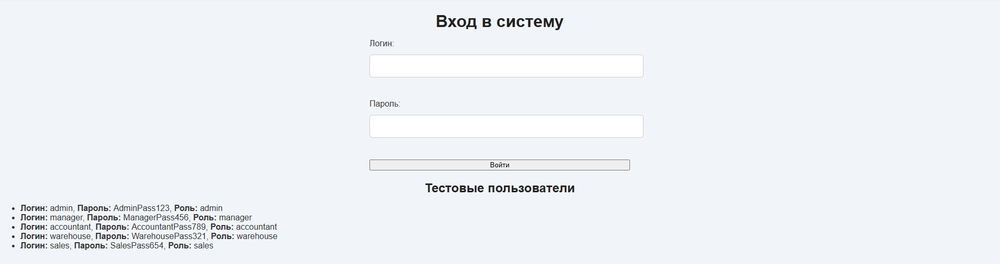

# <p align="center">МИНИСТЕРСТВО ОБРАЗОВАНИЯ, НАУКИ И МОЛОДЁЖНОЙ ПОЛИТИКИ РЕСПУБЛИКИ КОМИ</p>

<p align="center">Государственное профессиональное образовательное учреждение
"Сыктывкарский политехнический техникум"</p>

## <p align="center">Курсовая работа</p>

<p align="center">Тема: База данных торговой организации</p>

**<p align="right">Профессия / специальность</p>**

<p align="right">Информационные системы и программирование</p>

**<p align="right">Выполнил</p>**

<p align="right">Анчиков Антон Дмитриевич</p>

<p align="right">Дневная, 4 курс, 414гр.</p>

**<p align="right">Руководитель</p>**

<p align="right">Пунгин И.В.</p>

## Задание на курсовую работу по МДК 11.01 "Технология разработки и защиты баз данных"

Специальность: 09.02.07 "Информационные системы и программирование"

Тема курсовой работы: База данных торговой организации

Срок представления работы к защите: 15 марта 2025 года.

### <a id="content">Содержание</a>

1. [Введение](#introduction)
    - [Цель работы](#target)
    - [Задачи работы](#tasks)
2. [Основная часть](#main)
    - [Анализ предметной области. Постановка задачи](#analysis)
    - [Инфологическая (концептуальная) модель базы данных](#Infological_model)
    - [Логическая структура БД](#Logical_structure)
    - [Физическая структура базы данных](#Physical_scructure)
    - [Реализация проекта в среде конкретной СУБД](#Project_realization)
3. [Заключение](#Conclusion)

### <a id="introduction">Введение</a>

В современном мире автоматизация бизнес-процессов играет ключевую роль в повышении эффективности работы организаций. Торговые организации сталкиваются с необходимостью управления большими объёмами данных: заказы, клиенты, товары, сотрудники, финансы. Для решения этих задач разработано веб-приложение, которое позволяет автоматизировать процессы управления торговой организацией. Приложение взаимодействует с базой данных, обеспечивая хранение, обработку и безопасный доступ к информации.

#### <a id="target">Цель работы</a>

Целью работы является разработка веб-приложения для управления торговой организацией, которое обеспечивает автоматизацию процессов учёта заказов, клиентов, товаров и финансовых операций.

#### <a id="tasks">Задачи работы</a>

1. Провести анализ предметной области и сформулировать требования к системе.
2. Разработать инфологическую (концептуальную) модель базы данных.
3. Спроектировать логическую и физическую структуру базы данных.
4. Реализовать базу данных в среде СУБД PostgreSQL.
5. Разработать веб-приложение с использованием PHP, HTML, CSS и JavaScript.
6. Обеспечить разграничение прав доступа для различных ролей пользователей.

[Вернуться к содержанию](#content)

### <a id="main">Основная часть</a>

#### <a id="analysis">Анализ предметной области. Постановка задачи</a>

1. **Описание предметной области и функции решаемых задач**
    - **Предметная область** современные торговые организации сталкиваются с необходимостью эффективного управления товарными запасами, обработкой заказов и взаимодействием с клиентами и поставщиками. Ведение учета вручную или с использованием устаревших методов (например, таблицы Excel) приводит к потере времени, возникновению ошибок и снижению качества обслуживания. Для решения этих проблем создается информационная система управления торговой организацией, целью которой является автоматизация учета товаров, заказов, клиентов и поставщиков, а также оптимизация бизнес-процессов компании. Данная система предназначена для использования в торговых компаниях, занимающихся продажей товаров через склады, магазины или интернет-магазины.
    - **Функции решаемых задач:**
        - **Управление товарами:**
            - Добавление, редактирование и удаление товаров.
            - Классификация товаров по категориям.
            - Учет поставщиков товаров.
            - Контроль остатков на складе.
        - **Управление заказами:** 
            - Создание заказов.
            - Привязка заказа к клиенту и ответственному сотруднику.
            - Автоматический расчет общей стоимости заказа.
            - Учет деталей заказа (количество товаров, цена за единицу).
            - Фиксация статуса заказа.
        - **Управление клиентами:**
            - Ведение базы данных клиентов.
            - Хранение контактной информации клиентов.
            - Отслеживание истории заказов клиентов.
        - **Работа с поставщиками:**
            - Ведение списка поставщиков.
            - Хранение информации о контактных лицах.
            - Учет закупок товаров.
        - **Управление сотрудниками:**
            - Ведение списка сотрудников.
            - Разграничение доступа к данным по ролям (администратор, менеджер, сотрудник склада и т. д.).
            - Отслеживание активности сотрудников.
        - **Аутентификация пользователей:**
            - Авторизация пользователей в системе.
            - Хранение данных о паролях и ролях пользователей.
        
    Таким образом, система позволит автоматизировать основные процессы работы торговой организации, сократить влияние человеческого фактора и повысить скорость обработки заказов.
2. **Перечень входных данных.** Входные данные представляют собой информацию, необходимую для работы системы. Они поступают от пользователей, а также могут быть загружены из других источников. **Основные категории входных данных:**
    - **Данные о товарах:**
        - Уникальный идентификатор товара (product_id).
        - Название товара.
        - Категория товара.
        - Поставщик.
        - Цена за единицу.
        - Количество товара на складе.
        - Краткое описание товара.
    - **Данные о заказах:**
        - Уникальный идентификатор заказа (order_id).
        - Дата создания заказа.
        - Клиент, оформивший заказ.
        - Перечень заказанных товаров.
        - Количество каждого товара в заказе.
        - Итоговая стоимость заказа.
        - Ответственный сотрудник.
    - **Данные о клиентах:**
        - Уникальный идентификатор клиента (customer_id).
        - Имя и фамилия.
        - Контактные данные (телефон, email, адрес).
        - История заказов.
    - **Данные о поставщиках:**
        - Уникальный идентификатор поставщика (supplier_id).
        - Название компании.
        - Контактное лицо.
        - Адрес.
        - Телефон и email.
    - **Данные о сотрудниках:**
        - Уникальный идентификатор сотрудника (employee_id).
        - ФИО.
        - Должность.
        - Дата приема на работу.
        - Зарплата.
    - **Данные о пользователях системы:**
        - Уникальный идентификатор пользователя (user_id).
        - Имя пользователя (логин).
        - Пароль.
        - Роль в системе.
        - Дата регистрации.
    
    Эти данные вводятся через интерфейс системы, импортируются из файлов или добавляются вручную администраторами.
3. **Перечень выходных данных.** Система должна формировать следующие виды выходных данных:
    - **Отчеты по товарам:**
        - Список товаров с текущими остатками.
        - Отчет по наиболее популярным товарам.
        - Отчет о товарах, требующих пополнения.
    - **Отчеты по заказам:**
        - Журнал всех заказов.
        - Заказы по конкретному клиенту.
        - Заказы за определенный период.
        - Отчет по выполненным и невыполненным заказам.
    - **Отчеты по клиентам:**
        - Список клиентов.
        - История заказов клиентов.
        - Контактные данные клиентов.
    - **Отчеты по поставщикам:**
        - Список всех поставщиков.
        - История поставок от конкретного поставщика.
    - **Отчеты по сотрудникам:**
        - Список сотрудников и их роли.
        - История обработки заказов сотрудниками.

    Выходные данные могут быть экспортированы в CSV, Excel или PDF для дальнейшего анализа.
4. **Ограничения предметной области.** При работе с базой данных могут возникнуть следующие ограничения:
    - **Географическое ограничение:** Система предназначена для использования внутри одной компании и не поддерживает управление филиалами.
    - **Функциональные ограничения:** Система не поддерживает автоматическую интеграцию с внешними платежными системами. Отсутствует поддержка онлайн-оплаты. Движение товаров между складами фиксируется вручную.
    - **Ограничение по объёму данных:** Если количество товаров, клиентов или данных о продажах существенно возрастёт, это может негативно сказаться на скорости обработки запросов. Необходимо учитывать возможность оптимизации базы данных и использования индексации для ускорения обработки больших объёмов данных.
    - **Ограничение по доступу:** Данные, такие как личная информация о клиентах или данные о продажах, должны быть защищены от несанкционированного доступа. Это ограничение требует реализации надёжных механизмов авторизации и разграничения прав пользователей.
    - **Ограничение по обновлению данных:** Чтобы избежать потери данных, необходимо разработать систему резервного копирования. Это ограничение предполагает наличие регулярных бэкапов для предотвращения потерь информации в случае технических сбоев.
5. **Взаимодействие с другими программами.** База данных торговой организации может взаимодействовать с различными программами и модулями для расширения функциональности и повышения удобства работы:
    - **Программа для бухгалтерского учёта:** Автоматизация передачи данных о продажах в систему учёта поможет ускорить процесс финансовой отчётности и исключить возможные ошибки.
    - **CRM-система:** Интерграция с системой управления клиентами (Customer Relationship Management) позволит более эффективно работать с клиентами, вести их историю и предлагать персонализированнные предложения.
    - **Интернет-магазин:** Если торговая организация продаёт товары онлайн, база данных может быть интегрирована с сайтом или приложением, что позволит автоматически обновлять информацию о наличии товаров на складе и регистрировать заказы.
    - **Система аналитики:** Для анализа данных и визуализации отчётов можно интегрировать базу данных с аналитическими платформами (например, Power BI или Google Data Studio), что поможет строить более глубокий анализ показателей и получать наглядные отчёты.
    - **Электронной почтой:** Уведомления о новых заказах и статусе обработки.

[Вернуться к содержанию](#content)

#### <a id="Infological_model">Инфологическая (концептуальная) модель базы данных</a>

Инфологическая модель представляет собой концептуальное описание структуры данных, используемых в системе. Она включает в себя основные информационные объекты, их атрибуты и взаимосвязи.

1. **Выделение информационных объектов.** На основе анализа предметной области можно выделить следующие основные информационные объекты:
    - **Товары (Products)** - включает информацию о реализуемых товарах, их категории, поставщике и текущем количестве на складе.
    - **Категории товаров (Categories)** - служат для классификации товаров.
    - **Поставщики (Suppliers)** - содержат данные о компаниях, поставляющих товары.
    - **Склады (Warehouses)** - места хранения товаров.
    - **Запасы (Inventory)** - фиксирует количество товаров в каждом складе.
    - **Заказы (Orders)** - включает данные о заказах клиентов, их стоимости, дате оформления и исполнителе.
    - **Детали заказа (Order_details)** - конкретизируют, какие товары входят в заказ и в каком количестве.
    - **Клиенты (Customers)** - пользователи, оформляющие заказы.
    - **Сотрудники (Employees)** - менеджеры, оформляющие заказы и работающие с клиентами.
    - **Пользователи системы (Users)** - учетные записи, используемые для авторизации в системе.

    Эти объекты составляют основу информационной системы и являются ключевыми сущностями базы данных.

2. **Определение атрибутов объектов.** Каждый из выделенных объектов имеет свои атрибуты, которые хранят конкретные характеристики.
    - **Products (Товары):**
        - product_id (PK) - уникальный идентификатор.
        - product_name - название.
        - category_id (FK) - идентификатор категории.
        - supplier_id (FK) - идентификатор поставщика.
        - unit_price - цена.
        - units_in_stock - количество на складе.
        - description - описание.
    - **Categories (Категории):**
        - category_id (PK) - уникальный идентификатор.
        - category_name - название категории.
    - **Suppliers (Поставщики):**
        - supplier_id (PK) - уникальный идентификатор.
        - supplier_name - название компании.
        - contact_name - контактное лицо.
        - address - адрес.
        - phone - телефон.
        - email - электронная почта.
    - **Warehouses (Склады):**
        - warehouse_id (PK) - уникальный идентификатор.
        - warehouse_name - название склада.
        - address - адрес.
    - **Inventory (Запасы):**
        - inventory_id (PK) - уникальный идентификатор.
        - product_id (FK) - идентификатор товара.
        - warehouse_id (FK) - идентификатор склада.
        - quantity - количество.
    - **Orders (Заказы):**
        - order_id (PK) - уникальный идентификатор.
        - customer_id (FK) - идентификатор клиента.
        - employee_id (FK) - идентификатор сотрудника.
        - order_date - дата заказа.
        - total_amount - общая сумма.
    - **Order_details (Детали заказа):**
        - order_detail_id (PK) - уникальный идентификатор.
        - order_id (FK) - идентификатор заказа.
        - product_id (FK) - идентификатор товара.
        - quantity - количество.
        - unit_price - цена за единицу.
    - **Customers (Клиенты):**
        - customer_id (PK) - уникальный идентификатор.
        - first_name - имя.
        - last_name - фамилия.
        - email - электронная почта.
        - phone - телефон.
        - address - адрес.
    - **Employees (Сотрудники):**
        - employee_id (PK) - уникальный идентификатор.
        - first_name - имя.
        - last_name - фамилия.
        - position - должность.
        - hire_date - дата приема.
        - salary - зарплата.
    - **Users (Пользователи системы):**
        - user_id (PK) - уникальный идентификатор.
        - username - логин.
        - password - пароль.
        - role - роль.
        - created_at - дата регистрации.
    
    PK – первичный ключ (Primary Key).

    FK – внешний ключ (Foreign Key).

    Каждый объект содержит атрибуты, необходимые для его идентификации и хранения информации, связанной с бизнес-логикой системы.
    
3. **Определение отношений и мощности отношений между объектами.** Взаимосвязи между объектами системы можно представить в виде мощностей отношений:
    - **Категория - Товар:**
        - **Связь:** один ко многим.
        - **Описание:** Одна категория может содержать множество товаров, но каждый товар принадлежит только одной категории.
    - **Поставщики и Товары:**
        - **Связь:** один ко многим.
        - **Описание:** Один поставщик может поставлять несколько товаров, но каждый товар может иметь только одного поставщика
    - **Товары и Склады (Inventory):**
        - **Связь:** многие ко многим.
        - **Описание:** Один товар может храниться на нескольких складах, а один склад может содержать несколько товаров.
    - **Клиенты и Заказы:**
        - **Связь:** один ко многим.
        - **Описание:** Один клиент может оформить несколько заказов, но каждый заказ принадлежит только одному клиенту.
    - **Сотрудники и Заказы:**
        - **Связь:** один ко многим.
        - **Описание:** Один сотрудник может оформлять несколько заказов, но каждый заказ обрабатывается только одним сотрудником.
    - **Заказы и Детали заказов:**
        - **Связь:** один ко многим.
        - **Описание:** Один заказ может содержать несколько товаров, но каждая запись в деталях заказа относится к одному заказу.
    - **Товары и Детали заказов:**
        - **Связь:** один ко многим.
        - **Описание:** Один товар может быть включен в несколько заказов, но каждая запись в деталях заказа содержит только один товар.
    - **Пользователи и Сотрудники/Клиенты:**
        - **Связь:** один к одному.
        - **Описание:** Каждый пользователь системы (Users) может быть либо сотрудником, либо клиентом, но не обоими одновременно.
4. **Построение концептуальной модели.** Концептуальная модель базы данных представляется в виде ER-диаграммы (диаграммы «Сущность-Связь»), которая отражает все выделенные объекты и их взаимосвязи.
    - **Ключевые моменты модели:**
        - Все объекты связаны между собой согласно бизнес-логике системы.
        - Внешние ключи обеспечивают целостность данных и позволяют отслеживать взаимосвязи между таблицами.
        - Отношения M:N (многие ко многим) разрабатываются через промежуточные таблицы (например, Inventory, Order_details).

        

[Вернуться к содержанию](#content)

#### <a id="Logical_structure">Логическая структура базы данных</a>

Логическая структура базы данных представляет собой детализированное описание таблиц, их атрибутов, типов данных, а также ключевых ограничений и правил целостности. На основе концептуальной модели построена логическая структура, которая адаптирована для использования в PostgreSQL.

В данной структуре определены следующие таблицы: Пользователи, Сотрудники, Клиенты, Поставщики, Категории, Продукты, Склады, Запасы, Заказы, Детали заказов, а также их связи.

1. **Определение таблиц и их структур.**
    - **1. Таблица categories (Категории товаров)**
        - category_id (PK) - уникальный идентификатор категории.
        - category_name - название категории.
    - **Типы данных**
        - category_id (PK) - SERIAL.
        - category_name - VARCHAR(255) NOT NULL UNIQUE.
    - **Ограничения** 
        - category_id – первичный ключ.
        - category_name – уникальный и не NULL.
    - **2. Таблица suppliers (Поставщики)**
        - supplier_id (PK) - уникальный идентификатор поставщика.
        - supplier_name - название поставщика.
        - contact_name - контактное лицо.
        - address - адрес компании.
        - phone	- контактный номер.
        - email - электронная почта.
    - **Типы данных**
        - supplier_id (PK) - SERIAL.
        - supplier_name - VARCHAR(255) NOT NULL.
        - contact_name - VARCHAR(255).
        - address - TEXT.
        - phone	- VARCHAR(20).
        - email - VARCHAR(255) UNIQUE.
    - **Ограничения** 
        - supplier_id – первичный ключ.
        - supplier_name - не NULL.
        - email – уникальный.
    - **3. Таблица warehouses (Склады)**
        - warehouse_id (PK) - уникальный идентификатор склада.
        - warehouse_name - название склада.
        - address - адрес склада.
    - **Типы данных**
        - warehouse_id (PK) - SERIAL.
        - warehouse_name - VARCHAR(255) NOT NULL UNIQUE.
        - address - TEXT NOT NULL.
    - **Ограничения** 
        - warehouse_id – первичный ключ.
        - warehouse_name - VARCHAR(255) NOT NULL UNIQUE.
        - address – не NULL.
    - **4. Таблица products (Товары)**
        - product_id (PK) - уникальный идентификатор товара.
        - product_name - название товара.
        - category_id (FK) - категория товара.
        - supplier_id (FK) - поставщик товара.
        - unit_price - цена товара.
        - units_in_stock - количество на складе.
        - description - описание товара.
    - **Типы данных**
        - product_id (PK) - SERIAL.
        - product_name - VARCHAR(255) NOT NULL.
        - category_id (FK) - INT REFERENCES categories(category_id) ON DELETE SET NULL.
        - supplier_id (FK) - INT REFERENCES suppliers(supplier_id) ON DELETE SET NULL.
        - unit_price - DECIMAL(10,2) NOT NULL CHECK (unit_price >= 0).
        - units_in_stock - INT NOT NULL CHECK (units_in_stock >= 0).
        - description - TEXT.
    - **Ограничения** 
        - product_id – первичный ключ.
        - category_id, supplier_id – внешние ключи.
        - unit_price и units_in_stock – проверка на неотрицательное значение.
        - supplier_name - не NULL.
    - **5. Таблица inventory (Складские запасы)**
        - inventory_id (PK) - уникальный идентификатор записи.
        - product_id  (FK) - товар.
        - warehouse_id (FK) - склад.
        - quantity - количество товара.
    - **Типы данных**
        - inventory_id (PK) - SERIAL.
        - product_id (FK) - INT REFERENCES products(product_id) ON DELETE CASCADE.
        - warehouse_id (FK) - INT REFERENCES warehouses(warehouse_id) ON DELETE CASCADE.
        - quantity - INT NOT NULL CHECK (quantity >= 0).
    - **Ограничения** 
        - inventory_id – первичный ключ.
        - product_id, warehouse_id – внешние ключи.
        - quantity - проверка на неотрицательное значение.
    - **6. Таблица customers (Клиенты)**
        - customer_id (PK) - уникальный идентификатор клиента.
        - first_name - имя клиента.
        - last_name - фамилия клиента.
        - email - электронная почта.
        - phone - контактный номер.
        - address - адрес клиента.
    - **Типы данных**
        - customer_id (PK) - SERIAL.
        - first_name - VARCHAR(100) NOT NULL.
        - last_name - VARCHAR(100) NOT NULL.
        - email - VARCHAR(255) UNIQUE NOT NULL.
        - phone - VARCHAR(20).
        - address - TEXT.
    - **Ограничения** 
        - customer_id – первичный ключ.
        - first_name - не NULL.
        - last_name - не NULL.
        - email - уникальный и не NULL.
    - **7. Таблица employees (Сотрудники)**
        - employee_id (PK) - уникальный идентификатор сотрудника.
        - first_name - имя сотрудника.
        - last_name - фамилия сотрудника.
        - position - должность.
        - hire_date - дата приема на работу.
        - salary - зарплата.
    - **Типы данных**
        - employee_id (PK) - SERIAL.
        - first_name - VARCHAR(100) NOT NULL.
        - last_name - VARCHAR(100) NOT NULL.
        - position - VARCHAR(100).
        - hire_date - DATE NOT NULL.
        - salary - DECIMAL(10,2) CHECK (salary >= 0).
    - **Ограничения** 
        - employee_id – первичный ключ.
        - first_name - не NULL.
        - last_name - не NULL.
        - hire_date - не NULL.
        - salary - проверка на неотрицательное значение.
    - **8. Таблица orders (Заказы)**
        - order_id (PK) - уникальный идентификатор заказа.
        - customer_id (FK) - клиент.
        - employee_id (FK) - сотрудник.
        - order_date - дата оформления.
        - total_amount - общая сумма.
    - **Типы данных**
        - order_id (PK) - SERIAL.
        - customer_id (FK) - INT REFERENCES customers(customer_id) ON DELETE SET NULL.
        - employee_id (FK) - INT REFERENCES employees(employee_id) ON DELETE SET NULL.
        - order_date - TIMESTAMP DEFAULT CURRENT_TIMESTAMP.
        - total_amount - DECIMAL(10,2) NOT NULL CHECK (total_amount >= 0).
    - **Ограничения** 
        - order_id – первичный ключ.
        - customer_id, employee_id - внешние ключи.
        - total_amount - проверка на неотрицательное значение.
    - **9. Таблица order_details (Детали заказа)**
        - order_detail_id (PK) - уникальный идентификатор деталей.
        - order_id (FK) - заказ.
        - product_id (FK) - товар.
        - quantity - количество товара.
        - unit_price - цена товара.
    - **Типы данных**
        - order_detail_id (PK) - SERIAL.
        - order_id (FK) - INT REFERENCES orders(order_id) ON DELETE CASCADE.
        - product_id (FK) - INT REFERENCES products(product_id) ON DELETE CASCADE.
        - quantity - INT NOT NULL CHECK (quantity > 0).
        - unit_price - DECIMAL(10,2) NOT NULL CHECK (unit_price >= 0).
    - **Ограничения** 
        - order_detail_id – первичный ключ.
        - order_id, product_id - внешние ключи.
        - quantity - должно быть больше 0.
        - unit_price - проверка на неотрицательное значение.
    - **10. Таблица users (Пользователи системы)**
        - user_id (PK) - уникальный идентификатор пользователя.
        - username - логин.
        - password - пароль.
        - role - роль пользователя.
        - created_at - дата создания.
    - **Типы данных**
        - user_id (PK) - SERIAL.
        - username - VARCHAR(100) UNIQUE NOT NULL.
        - password - TEXT NOT NULL.
        - role - VARCHAR(50) CHECK (role IN ('admin', 'manager', 'accountant', 'warehouse', 'sales')) NOT NULL.
        - created_at - TIMESTAMP DEFAULT CURRENT_TIMESTAMP.
    - **Ограничения** 
        - user_id – первичный ключ.
        - username - уникальный и не NULL.
        - password - не NULL и захеширован.
        - role - строго ограничен значениями 'admin', 'manager', 'accountant', 'warehouse', 'sales'.
2. **Определение связей между таблицами.**
    - **Ключевые связи:**
        - products.category_id → categories.category_id (Один ко многим).
        - products.supplier_id → suppliers.supplier_id (Один ко многим).
        - inventory.product_id → products.product_id (Многие ко многим).
        - inventory.warehouse_id → warehouses.warehouse_id (Многие ко многим).
        - orders.customer_id → customers.customer_id (Один ко многим).
        - orders.employee_id → employees.employee_id (Один ко многим).
        - order_details.order_id → orders.order_id (Один ко многим).
        - order_details.product_id → products.product_id (Один ко многим).
        - users.user_id → employees.employee_id или customers.customer_id (Один к одному).

    Эти связи обеспечивают целостность данных и правильную логику работы системы.

3. **Нормализация базы данных.** 

    На данном этапе структура базы данных приведена к третьей нормальной форме (3NF), что позволяет:
    - Устранить избыточность данных.
    - Избежать аномалий при добавлении, изменении и удалении данных.
    - Обеспечить более эффективное использование памяти и более быструю обработку запросов.

4. **Обеспечение целостности данных.**

    Для предотвращения ошибок и дублирования информации применяются ограничения:
    - **NOT NULL** – атрибут не может содержать NULL-значения.
    - **CHECK** – проверка значений (например, цены товаров и зарплаты сотрудников не могут быть отрицательными).
    - **UNIQUE** – уникальные значения (например, email клиентов и username пользователей).
    - **ON DELETE CASCADE / SET NULL** – определяет поведение при удалении связанных данных.

Логическая структура базы данных детально определяет таблицы, их атрибуты, связи и ограничения, обеспечивая корректное хранение данных и их целостность. PostgreSQL предоставляет мощные инструменты для эффективного управления данными, а использование индексов и ограничений позволяет повысить производительность и надежность системы.

[Вернуться к содержанию](#content)

#### <a id="Physical_scructure">Физическая структура базы данных</a>

Физическая структура базы данных отвечает за реальное хранение данных на физическом уровне, определяет способы хранения и работы с данными, обеспечивая при этом их целостность, доступность и производительность системы. На этом этапе важно учитывать оптимизацию производительности запросов, объёмы данных и ограничения, связанные с физическим хранением данных в выбранной СУБД. В данной курсовой работе предполагается использование реляционной СУБД (PostgreSQL), так как они предоставляют оптимальные средства для управления табличными данными и поддерживают сложные связи между данными, что необходимо для торговой организации.

Физическая структура проектируется таким образом, чтобы система максимально эффективно обрабатывала данные, предоставляя пользователю доступ к нужной информации с минимальной задержкой. Это достигается с помощью выбора правильных типов данных, индексов, механизмов хранения и настройки параметров, обеспечивающих производительность и надежность.

1. **Выбор типов данных**

    Правильный выбор типов данных для полей таблиц — один из ключевых аспектов проектирования физической структуры базы данных, так как это позволяет экономить ресурсы и повышать производительность.

    **Рассмотрим их применение в нашей системе:**

    - **SERIAL** – используется для автоматической генерации уникальных идентификаторов.
    - **VARCHAR(n)** – применяется для хранения текстовых данных переменной длины.
    - **DECIMAL(10,2)** – используется для хранения денежных значений, требующих высокой точности.
    - **TIMESTAMP** – фиксирует временные отметки при выполнении операций.
    - **INT** – используется для целочисленных значений, таких как количество товаров и внешние ключи.
    - **TEXT** – применяется для длинных описательных данных, например, адресов.

    Правильный выбор типа данных позволяет экономить дисковое пространство, ускорять работу индексов и улучшать производительность базы данных.

2. **Таблицы и их физическая реализация**
    - **Таблица categories (Категории товаров)** - используется для хранения информации о категориях товаров.
    ```
    CREATE TABLE categories (
    category_id SERIAL PRIMARY KEY,
    category_name VARCHAR(255) NOT NULL UNIQUE
    );
    ```
    - **Таблица suppliers (Поставщики)** - содержит данные о поставщиках товаров.
    ```
    CREATE TABLE suppliers (
    supplier_id SERIAL PRIMARY KEY,
    supplier_name VARCHAR(255) NOT NULL,
    contact_name VARCHAR(255),
    address TEXT,
    phone VARCHAR(20),
    email VARCHAR(255) UNIQUE
    );
    ```
    - **Таблица warehouses (Склады)** - хранит информацию о местах хранения товаров.
    ```
    CREATE TABLE warehouses (
    warehouse_id SERIAL PRIMARY KEY,
    warehouse_name VARCHAR(255) NOT NULL UNIQUE,
    address TEXT NOT NULL
    );
    ```
    - **Таблица products (Товары)** - описывает товары, хранящиеся на складах, их характеристики, категорию и поставщика.
    ```
    CREATE TABLE products (
    product_id SERIAL PRIMARY KEY,
    product_name VARCHAR(255) NOT NULL,
    category_id INT REFERENCES categories(category_id) ON DELETE SET NULL,
    supplier_id INT REFERENCES suppliers(supplier_id) ON DELETE SET NULL,
    unit_price DECIMAL(10,2) NOT NULL CHECK (unit_price >= 0),
    units_in_stock INT NOT NULL CHECK (units_in_stock >= 0),
    description TEXT
    );
    ```
    - **Таблица inventory (Складские запасы)** - отражает информацию о наличии товаров на складах.
    ```
    CREATE TABLE inventory (
    inventory_id SERIAL PRIMARY KEY,
    product_id INT REFERENCES products(product_id) ON DELETE CASCADE,
    warehouse_id INT REFERENCES warehouses(warehouse_id) ON DELETE CASCADE,
    quantity INT NOT NULL CHECK (quantity >= 0)
    );
    ```
    - **Таблица customers (Клиенты)** - хранит информацию о клиентах, совершающих заказы.
    ```
    CREATE TABLE customers (
    customer_id SERIAL PRIMARY KEY,
    first_name VARCHAR(100) NOT NULL,
    last_name VARCHAR(100) NOT NULL,
    email VARCHAR(255) UNIQUE NOT NULL,
    phone VARCHAR(20),
    address TEXT
    );
    ```
    - **Таблица employees (Сотрудники)** - описывает сотрудников, занимающихся обработкой заказов.
    ```
    CREATE TABLE employees (
    employee_id SERIAL PRIMARY KEY,
    first_name VARCHAR(100) NOT NULL,
    last_name VARCHAR(100) NOT NULL,
    position VARCHAR(100),
    hire_date DATE NOT NULL,
    salary DECIMAL(10,2) CHECK (salary >= 0)
    );
    ```
    - **Таблица orders (Заказы)** - содержит информацию о заказах, оформленных клиентами.
    ```
    CREATE TABLE orders (
    order_id SERIAL PRIMARY KEY,
    customer_id INT REFERENCES customers(customer_id) ON DELETE SET NULL,
    employee_id INT REFERENCES employees(employee_id) ON DELETE SET NULL,
    order_date TIMESTAMP DEFAULT CURRENT_TIMESTAMP,
    total_amount DECIMAL(10,2) NOT NULL CHECK (total_amount >= 0)
    );
    ```
    - **Таблица order_details (Детали заказа)** - хранит информацию о товарах, входящих в заказ.
    ```
    CREATE TABLE order_details (
    order_detail_id SERIAL PRIMARY KEY,
    order_id INT REFERENCES orders(order_id) ON DELETE CASCADE,
    product_id INT REFERENCES products(product_id) ON DELETE CASCADE,
    quantity INT NOT NULL CHECK (quantity > 0),
    unit_price DECIMAL(10,2) NOT NULL CHECK (unit_price >= 0)
    );
    ```
    - **Таблица users (Пользователи системы)** - содержит учетные данные пользователей системы.
    ```
    CREATE TABLE users (
    user_id SERIAL PRIMARY KEY,
    username VARCHAR(100) UNIQUE NOT NULL,
    password TEXT NOT NULL,
    role VARCHAR(50) CHECK (role IN ('admin', 'employee', 'customer')) NOT NULL,
    created_at TIMESTAMP DEFAULT CURRENT_TIMESTAMP
    );
    ```

3. **Оптимизация индексов**

    Индексы являются ключевым элементом в оптимизации базы данных, так как они позволяют ускорить доступ к данным и облегчают выполнение запросов, таких как поиск, фильтрация и сортировка. Индексы создаются для полей, которые часто участвуют в поисковых запросах и соединениях таблиц. В физической структуре базы данных индексы устанавливаются на ключевых полях:

    - **Первичные ключи** автоматически индексируются, так как они служат для уникальной идентификации каждой записи. Это гарантирует быстрое выполнение операций поиска и обновления записей.
    - **Внешние ключи** (например, ID_категории, ID_поставщика, ID_клиента) также индексируются, чтобы ускорить выполнение соединений между таблицами. Внешние ключи позволяют поддерживать целостность данных, предотвращая создание записей, не соответствующих связанным данным.
    - **Дополнительные индексы** — в зависимости от анализа предполагаемых запросов можно добавить индексы для часто запрашиваемых полей.

    **Создание индексов:**

    1. **Таблица categories (Категории товаров)**
    ```
    CREATE INDEX idx_category_name ON categories(category_name);
    ```
    2. **Таблица suppliers (Поставщики)**
    ```
    CREATE INDEX idx_supplier_name ON suppliers(supplier_name);
    CREATE INDEX idx_supplier_email ON suppliers(email);
    CREATE INDEX idx_supplier_phone ON suppliers(phone);
    ```
    3. **Таблица warehouses (Склады)**
    ```
    CREATE INDEX idx_warehouse_name ON warehouses(warehouse_name);
    ```
    4. **Таблица products (Товары)**
    ```
    CREATE INDEX idx_product_name ON products(product_name);
    CREATE INDEX idx_category_id ON products(category_id);
    CREATE INDEX idx_supplier_id ON products(supplier_id);
    CREATE INDEX idx_product_price ON products(unit_price);
    CREATE INDEX idx_product_stock ON products(units_in_stock);
    ```
    5. **Таблица inventory (Складские запасы)**
    ```
    CREATE INDEX idx_inventory_product ON inventory(product_id);
    CREATE INDEX idx_inventory_warehouse ON inventory(warehouse_id);
    CREATE INDEX idx_inventory_stock ON inventory(quantity);
    ```
    6. **Таблица customers (Клиенты)**
    ```
    CREATE INDEX idx_customer_name ON customers(last_name, first_name);
    CREATE INDEX idx_customer_email ON customers(email);
    CREATE INDEX idx_customer_phone ON customers(phone);
    ```
    7. **Таблица employees (Сотрудники)**
    ```
    CREATE INDEX idx_employee_name ON employees(last_name, first_name);
    CREATE INDEX idx_employee_position ON employees(position);
    CREATE INDEX idx_employee_hire_date ON employees(hire_date);
    CREATE INDEX idx_employee_salary ON employees(salary);
    ```
    8. **Таблица orders (Заказы)**
    ```
    CREATE INDEX idx_order_customer ON orders(customer_id);
    CREATE INDEX idx_order_employee ON orders(employee_id);
    CREATE INDEX idx_order_date ON orders(order_date);
    CREATE INDEX idx_order_total ON orders(total_amount);
    ```
    9. **Таблица order_details (Детали заказов)**
    ```
    CREATE INDEX idx_order_details_order ON order_details(order_id);
    CREATE INDEX idx_order_details_product ON order_details(product_id);
    CREATE INDEX idx_order_details_price ON order_details(unit_price);
    ```
    10. **Таблица users (Пользователи системы)**
    ```
    CREATE INDEX idx_user_username ON users(username);
    CREATE INDEX idx_user_role ON users(role);
    ```

    **Преимущества индексов:**
    - Ускоряют поиск и сортировку.
    - Повышают производительность запросов с условиями фильтрации.
    - Уменьшают время выполнения операций соединения.

4. **Механизм хранения и параметры оптимизации**

    PostgreSQL использует механизм хранения данных, поддерживающий многоверсионность (MVCC, Multiversion Concurrency Control), что позволяет эффективно управлять транзакциями и конкурентным доступом к данным. В отличие от MySQL, PostgreSQL не требует явного указания механизма хранения при создании таблиц, так как все таблицы автоматически используют встроенный механизм. Этот механизм обеспечивает высокий уровень надежности, особенно для данных, подверженных частым изменениям, и поддерживает управление транзакциями, что критично для точности и согласованности данных.

    **Преимущества MVCC в PostgreSQL для базы данных торговой организации:**
    - **Поддержка транзакций** — гарантирует согласованность данных, например, при записи продаж и их составных частей. Каждая транзакция выполняется как отдельная операция, и в случае неудачи все изменения отменяются.
    - **Конкурентный доступ** — PostgreSQL позволяет нескольким пользователям одновременно работать с данными, обеспечивая при этом изоляцию транзакций, что делает его особенно подходящим для высоконагруженных приложений, где требуется частое обновление данных.
    - **Гибкое управление блокировками** — позволяет предотвращать конфликты между транзакциями и поддерживает высокую производительность.  

5. **Политики управления целостностью данных**

    PostgreSQL предоставляет богатый функционал для поддержания целостности данных с использованием различных ограничений и ключей. Эти механизмы помогают гарантировать, что база данных всегда находится в согласованном состоянии.

    **Основные элементы для управления целостностью:**
    - **Первичные ключи (PRIMARY KEY)** — используются для уникальной идентификации записей в таблицах. В PostgreSQL первичные ключи создаются с использованием уникального индекса и автоматически проверяют уникальность значения.
    - **Внешние ключи (FOREIGN KEY)** — обеспечивают целостность ссылочной структуры между таблицами. Внешние ключи используются, чтобы установить зависимость между записями.
    - **Ограничения NOT NULL** — применяются к полям, значения в которых обязательно должны быть указаны.
    - **CHECK-ограничения** — применяются для контроля значений полей в соответствии с установленными правилами.


6. **Параметры хранения и резервное копирование**

    Для обеспечения надежности базы данных торговой организации и защиты от потерь данных, в PostgreSQL необходимо организовать систему резервного копирования и продумать параметры хранения. PostgreSQL предлагает несколько методов резервного копирования и восстановления данных, а также настройки, которые влияют на производительность и безопасность системы.

    **Резервное копирование**

    PostgreSQL поддерживает два основных типа резервного копирования:
    - **Логическое резервное копирование** — выполняется с помощью утилиты pg_dump. Этот метод позволяет копировать структуру и данные одной или нескольких баз данных. Логическое копирование используется в ситуациях, когда требуется гибкость, например, для восстановления на другой версии PostgreSQL или для миграции данных.

    Пример использования pg_dump для создания резервной копии:
    ```
    pg_dump -U username -F c -b -v -f "backup_filename.backup" database_name
    ```

    Этот скрипт сохраняет базу данных в формате архивного файла, который затем можно будет использовать для восстановления.

    - **Физическое резервное копирование** — выполняется путем копирования файлов данных на уровне файловой системы. PostgreSQL предоставляет инструмент pg_basebackup, который выполняет копирование всех файлов базы данных и создаёт полную копию в заданном каталоге.

    Пример использования pg_basebackup:

    ```
    pg_basebackup -U postgres -D /path/to/backup -Ft -z -P
    ```

    Физическое резервное копирование особенно полезно для больших баз данных и высоконагруженных систем, так как оно позволяет быстрее восстанавливать данные и поддерживать согласованность на уровне файлов.

[Вернуться к содержанию](#content)

#### <a id="Project_realization">Реализация проекта в среде конкретной СУБД</a>

Этот раздел курсовой работы описывает практическую реализацию базы данных торговой организации в PostgreSQL. Рассматриваются основные этапы — от создания таблиц и запросов до разработки интерфейса и настройки прав доступа, индексов и резервного копирования.

1. **Создание пользователя и базы данных**
```
CREATE USER trade_organization WITH PASSWORD '1234';
CREATE DATABASE trade_organization OWNER trade_organization;
```
2. **Создание схемы базы данных**
```
CREATE SCHEMA trade_org;
```
3. **Создание таблиц**

    Скрипты создания всех таблиц указаны в разделе: [Физическая структура базы данных](#Physical_scructure)

4. **Заполнение базы данных начальными данными**

    1. **Заполнение таблицы warehouses (Склады)**
    ```
    INSERT INTO warehouses (warehouse_name, address) VALUES
    ('Склад Москва', 'Москва, ул. Ленина, 5'),
    ('Склад Санкт-Петербург', 'Санкт-Петербург, ул. Невская, 12'),
    ('Склад Новосибирск', 'Новосибирск, ул. Советская, 22'),
    ('Склад Екатеринбург', 'Екатеринбург, пр. Мира, 18'),
    ('Склад Казань', 'Казань, ул. Баумана, 33');
    ```
    2. **Заполнение таблицы categories (Категории товаров)**
    ```
    INSERT INTO categories (category_name) VALUES
    ('Электроника'),
    ('Бытовая техника'),
    ('Одежда'),
    ('Канцелярия'),
    ('Мебель'),
    ('Продукты питания'),
    ('Спорттовары'),
    ('Автозапчасти'),
    ('Игрушки'),
    ('Косметика');
    ```
    3. **Заполнение таблицы suppliers (Поставщики)**
    ```
    INSERT INTO suppliers (supplier_name, contact_name, address, phone, email) VALUES
    ('ООО ЭлектроТех', 'Иван Петров', 'Москва, ул. Электрозаводская, 8', '+7 495 123-45-67', 'info@electrotech.ru'),
    ('ЗАО ОдеждаСтиль', 'Мария Иванова', 'Санкт-Петербург, пр. Ленина, 10', '+7 812 987-65-43', 'contact@styleclothes.ru'),
    ('ООО КанцМаркет', 'Олег Смирнов', 'Новосибирск, ул. Чкалова, 15', '+7 383 456-78-90', 'contact@kanctorg.ru'),
    ('ИП Иванов', 'Иван Иванов', 'Казань, ул. Пушкина, 1', '+7 843 987-23-45', 'ivanov@ip.ru'),
    ('ООО АвтоДетали', 'Сергей Кузнецов', 'Екатеринбург, пр. Автозаводская, 14', '+7 343 567-45-67', 'autodetail@info.ru');
    ```
    4. **Заполнение таблицы products (Товары)**
    ```
    INSERT INTO products (product_name, category_id, supplier_id, unit_price, units_in_stock, description) VALUES
    ('Ноутбук HP Pavilion', 1, 1, 75000.00, 15, 'Ноутбук с Intel i5 и 16 ГБ ОЗУ'),
    ('Смартфон Samsung Galaxy S21', 1, 1, 65000.00, 30, 'Флагманский смартфон Samsung'),
    ('Телевизор Sony Bravia', 1, 1, 120000.00, 5, '4K телевизор с HDR'),
    ('Холодильник LG', 2, 1, 55000.00, 10, 'Двухкамерный холодильник с No Frost'),
    ('Футболка мужская', 3, 2, 1500.00, 50, '100% хлопок, размер M'),
    ('Кроссовки Nike', 7, 2, 8000.00, 20, 'Беговые кроссовки'),
    ('Ручка Parker', 4, 3, 500.00, 100, 'Металлическая шариковая ручка Parker'),
    ('Шкаф IKEA', 5, 3, 25000.00, 8, 'Деревянный шкаф для одежды'),
    ('Фары для Toyota Camry', 8, 5, 15000.00, 12, 'Оригинальные передние фары'),
    ('Игрушечная машинка Hot Wheels', 9, 4, 1200.00, 40, 'Коллекционная модель');
    ```
    5. **Заполнение таблицы inventory (Складские запасы)**
    ```
    INSERT INTO inventory (product_id, warehouse_id, quantity) VALUES
    (1, 1, 10), (2, 1, 20), (3, 2, 5), (4, 2, 15), (5, 1, 25), (6, 3, 10),
    (7, 4, 50), (8, 5, 8), (9, 3, 12), (10, 2, 40);
    ```
    6. **Заполнение таблицы customers (Клиенты)**
    ```
    INSERT INTO customers (first_name, last_name, email, phone, address) VALUES
    ('Алексей', 'Смирнов', 'alexey.smirnov@example.com', '+7 915 123-45-67','Москва, ул. Тверская, 10'),
    ('Ольга', 'Иванова', 'olga.ivanova@example.com', '+7 916 234-56-78','Санкт-Петербург, ул. Краснопрудная, 7'),
    ('Дмитрий', 'Кузнецов', 'dmitry.kuznetsov@example.com', '+7 917 345-67-89', 'Новосибирск, ул. Красная, 23'),
    ('Елена', 'Соколова', 'elena.sokolova@example.com', '+7 918 456-78-90','Екатеринбург, ул. Ленина, 5'),
    ('Сергей', 'Федоров', 'sergey.fedorov@example.com', '+7 919 567-89-01', 'Казань, ул. Баумана, 33');
    ```
    8. **Заполнение таблицы orders (Заказы)**
    ```
    INSERT INTO orders (customer_id, employee_id, order_date, total_amount) VALUES
    (1, 1, '2024-03-01 14:30:00', 140000.00),
    (2, 2, '2024-03-02 16:15:00', 123000.00),
    (3, 3, '2024-03-03 11:00:00', 178000.00),
    (4, 4, '2024-03-04 12:45:00', 86000.00),
    (5, 5, '2024-03-05 15:30:00', 2700.00),
    (1, 3, '2024-03-06 10:20:00', 65500.00),
    (3, 2, '2024-03-07 18:10:00', 45000.00),
    (2, 4, '2024-03-08 13:40:00', 98000.00);
    ```
    9. **Заполнение таблицы order_details (Состав заказов)**
    ```
    INSERT INTO order_details (order_id, product_id, quantity, unit_price) VALUES
    (1, 1, 1, 75000.00), 
    (1, 2, 2, 65000.00), 
    (2, 3, 1, 120000.00), 
    (2, 5, 2, 1500.00), 
    (3, 4, 1, 55000.00), 
    (3, 6, 3, 8000.00), 
    (3, 7, 2, 500.00), 
    (4, 8, 1, 25000.00), 
    (4, 9, 1, 15000.00), 
    (4, 10, 3, 1200.00), 
    (5, 5, 2, 1500.00), 
    (5, 7, 4, 500.00), 
    (6, 3, 1, 120000.00), 
    (6, 6, 2, 8000.00), 
    (7, 2, 1, 65000.00), 
    (7, 4, 1, 55000.00), 
    (8, 1, 1, 75000.00), 
    (8, 9, 2, 15000.00);
    ```
    10. **Заполнение таблицы users (Пользователи системы)**
        Таблица заполняется с помощью скрипта, где сразу хешируется пароль: [createusers](/createusers.php)
5. **Настройка индексов**

    Скрипты создания всех индексов указаны в разделе: [Физическая структура базы данных](#Physical_scructure)
6. **Реализация пользователей и прав доступа**

    1. **Создание пользователей**
        ```
        CREATE ROLE admin WITH LOGIN PASSWORD 'AdminPass123';
        CREATE ROLE manager WITH LOGIN PASSWORD 'ManagerPass456';
        CREATE ROLE accountant WITH LOGIN PASSWORD 'AccountantPass789';
        CREATE ROLE warehouse WITH LOGIN PASSWORD 'WarehousePass321';
        CREATE ROLE sales WITH LOGIN PASSWORD 'SalesPass654';
        ```
    2. **Настройка прав доступа**
        ```
        GRANT CONNECT ON DATABASE trade_organization TO admin, manager, accountant, warehouse, sales;
        ```
        1. **Админ**
        ```
        GRANT ALL PRIVILEGES ON ALL TABLES IN SCHEMA trade_org TO admin;
        GRANT ALL PRIVILEGES ON ALL SEQUENCES IN SCHEMA trade_org TO admin;
        ```
        2. **Менеджер**
        ```
        GRANT SELECT, INSERT, UPDATE, DELETE ON customers TO manager;
        GRANT SELECT, INSERT, UPDATE, DELETE ON employees TO manager;
        GRANT SELECT, INSERT, UPDATE, DELETE ON products TO manager;
        GRANT SELECT, INSERT, UPDATE, DELETE ON categories TO manager;
        GRANT SELECT, INSERT, UPDATE, DELETE ON suppliers TO manager;
        GRANT SELECT, INSERT, UPDATE, DELETE ON warehouses TO manager;
        GRANT SELECT, INSERT, UPDATE, DELETE ON inventory TO manager;
        GRANT SELECT, INSERT, UPDATE, DELETE ON orders TO manager;
        GRANT SELECT, INSERT, UPDATE, DELETE ON order_details TO manager;
        ```
        3. **Бухгалтер**
        ```
        GRANT SELECT ON customers TO accountant;
        GRANT SELECT ON employees TO accountant;
        GRANT SELECT ON orders TO accountant;
        GRANT SELECT ON order_details TO accountant;
        ```
        4. **Работник склада**
        ```
        GRANT SELECT, INSERT, UPDATE, DELETE ON warehouses TO warehouse;
        GRANT SELECT, INSERT, UPDATE, DELETE ON inventory TO warehouse;
        ```
        5. **Продавец**
        ```
        GRANT SELECT, INSERT, UPDATE ON customers TO sales;
        GRANT SELECT, INSERT, UPDATE, DELETE ON orders TO sales;
        GRANT SELECT, INSERT, UPDATE, DELETE ON order_details TO sales;
        ```
7. **Разработка стратегии резервного копирования базы данных**

    Для защиты данных от сбоев и потерь необходимо разработать стратегию регулярного резервного копирования. Для PostgreSQL основными методами являются:

    - **Ежедневное логическое резервное копирование с помощью pg_dump** — позволяет создавать бэкап базы данных в формате SQL. Эти резервные копии можно хранить на удаленном сервере или в облаке.

    Пример ежедневного резервного копирования:
    ```
    pg_dump -U username -F c -b -v -f "/backups/backup_$(date +\%Y\%m\%d).backup" database_name
    ```
    - **Архивирование WAL-журналов** — для минимизации потерь данных в случае сбоя базы данных необходимо регулярно копировать файлы журнала WAL. Это позволит откатить базу до последнего зафиксированного состояния.
    
    Пример настройки архивации WAL:
    ```
    archive_mode = on
    archive_command = 'cp %p /path/to/archive/%f'
    ```
    - **Полное физическое резервное копирование раз в неделю с использованием pg_basebackup** — особенно полезно для больших объемов данных, так как обеспечивает быстрое восстановление базы данных.

    Пример команды:
    ```
    pg_basebackup -U postgres -D /path/to/backup -Ft -z -P
    ```
    - **Проверка и тестирование восстановлений** — резервное копирование должно регулярно тестироваться на восстановление, чтобы убедиться в работоспособности резервных копий. Это критически важно для обеспечения постоянной доступности и надежности данных.

    Стратегия резервного копирования должна включать хранение нескольких копий данных на случай различных инцидентов, таких как сбой оборудования или ошибка администратора.
8. **Разработка интерфейса**

    Взаимодействие с базой данных будет организовано с помощью HTML, CSS, JavaScript и PHP. Веб-интерфейс должен быть удобным, интуитивно понятным и обеспечивать безопасный доступ к данным в зависимости от роли пользователя.
    
     **Основные функции интерфейса должны включать:**
    - **Авторизацию** - позволяет пользователям входить в систему с различными ролями.
    
    - **Панель администратора**
    
    - **Панель менеджера**
    
    - **Панель бухгалтера**
    
    - **Панель работника склада**
    
    - **Панель продавца**
    


[Вернуться к содержанию](#content)

### <a id="Conclusion">Заключение</a>

В ходе выполнения данной курсовой работы была разработана и реализована реляционная база данных для торговой организации с использованием PostgreSQL. Также был создан удобный веб-интерфейс для взаимодействия с данными, обеспечивающий доступность, безопасность и эффективность работы системы.

**В процессе работы были решены следующие задачи:**
- Разработан анализ предметной области и определены основные требования к системе.
- Построена концептуальная, логическая и физическая модель базы данных.
- Создана база данных с оптимизированной структурой, обеспечивающей целостность и быстродействие.
- Настроены индексы и ограничения для оптимизации выполнения запросов.
- Реализованы механизмы разграничения доступа в зависимости от роли пользователя (администратор, менеджер, бухгалтер, работник склада, продавец).
- Разработан веб-интерфейс с удобной системой управления данными.
- Обеспечена безопасность системы с помощью хеширования паролей, защитных механизмов PostgreSQL и авторизации пользователей.

Созданная система позволяет автоматизировать работу торговой организации, улучшая процессы управления товарами, заказами, клиентами, складскими запасами и финансовыми расчетами. Веб-интерфейс делает работу сотрудников интуитивно понятной и удобной, а оптимизированная структура базы данных гарантирует быстрое выполнение запросов даже при увеличении объема информации.

**Дальнейшие перспективы:**

Разработанная база данных и интерфейс могут быть доработаны и расширены в будущем, например, путем:
- Внедрения аналитических отчетов для более глубокого анализа продаж и прибыли.
- Добавления механизма уведомлений о низких запасах товаров.
- Интеграции с онлайн-магазином или другими сервисами.
- Автоматического генерирования документов (накладные, счета-фактуры и т. д.).

Разработанная система полностью соответствует поставленным требованиям и демонстрирует практическое применение современных технологий хранения и управления данными. Данный проект может быть использован как основа для автоматизации бизнес-процессов в торговой сфере и легко масштабируется при необходимости.

Руководитель работы __________________ И. В. Пунгин

Задание принял к исполнению _______________________________ А. Д. Анчиков